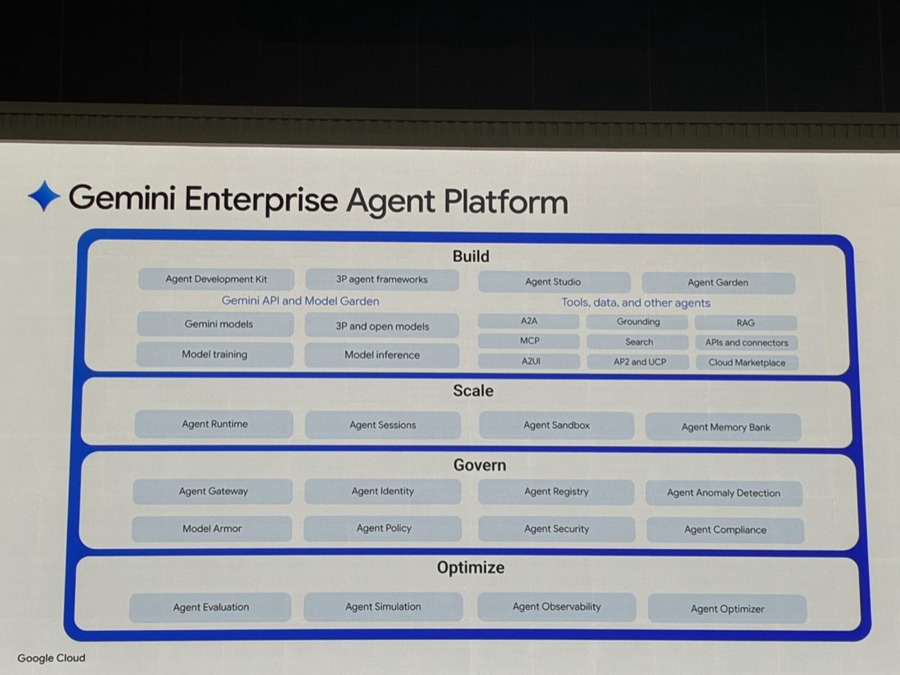
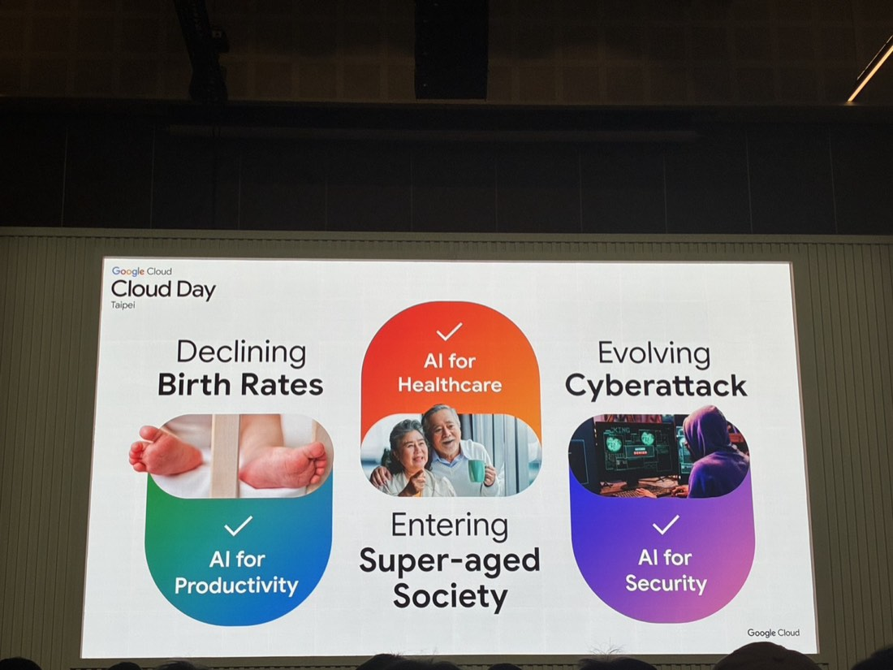
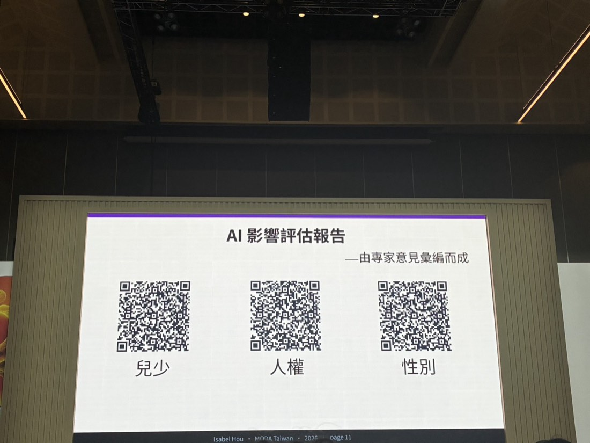
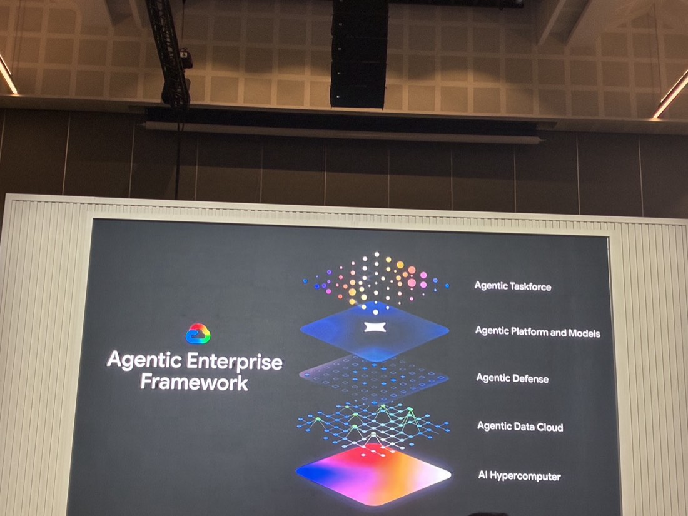
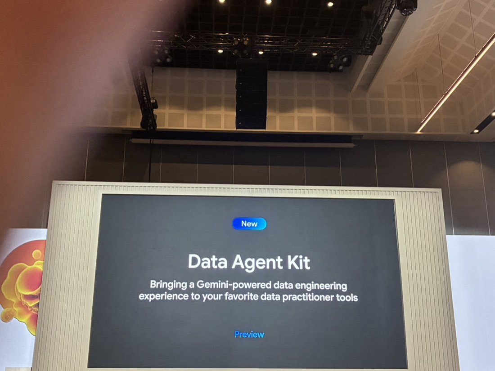
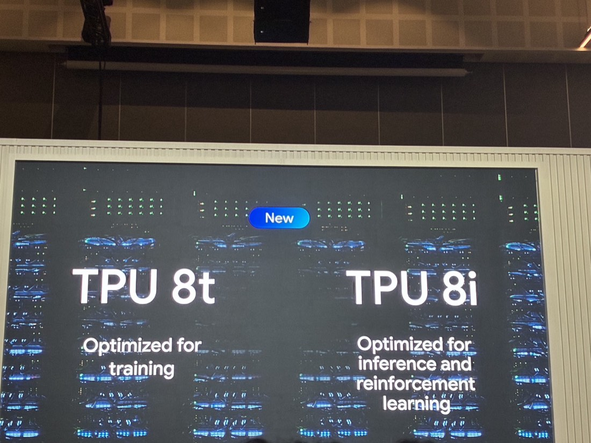

# AI 領航、智匯台灣
*Cloud Day 2026・2026-07-09*
> 從台灣少子化、超高齡化、資安威脅三大社會挑戰出發，帶出「AI 要能解決真實問題」的框架；數位發展部說明國家 AI 發展綱領草案與 AI 基本法，Google Cloud 則展示其完整的 Agentic Enterprise 技術堆疊。
*上午・主題演講*

**Harry Lin 林書平**・Google Cloud 台灣技術總經理
**Tina Lin 林雅芳**・Google 台灣總經理
**Isabel Hou 侯宜秀**・數位發展部政務次長

## 三大社會挑戰，帶出 AI 應用框架

開場用台灣正在面對的三個結構性問題，對應到三個 AI 應用方向——不是趕流行，是解方：

- **少子化 Declining Birth Rates**：→ AI for Productivity（提升生產力補足勞動力缺口）
- **超高齡社會 Super-aged Society**：→ AI for Healthcare（醫療照護場景）
- **資安威脅演化 Evolving Cyberattack**：→ AI for Security（資安防護）

*Google Cloud Day Taipei 開場投影片：三大社會挑戰對應三個 AI 應用方向*

## 數位發展部政策說明（Isabel Hou）

**國家人工智慧發展綱領（草案）**與**AI 基本法**逐條對照：

| 綱領項目 | 內容 | 對應 AI 基本法 |
| --- | --- | --- |
| **戰略目標** | 確立我國 AI 發展的核心價值：建構主權 AI，讓台灣成為立基於自由民主價值的「AI 良善應用典範」 | §1、4 以人為本、永續發展、七大原則 |
| **算力及能源** | 公私協力建構充足運算設施，增進產業、教育與學研近用權；算力建設規劃需與能源策略並行 | §8、10 人工智慧研發、應用基礎建設 |
| **資料創新利用與治理** | 完備資料治理，擴大語料來源，完備 AI 訓練語料庫以發展主權 AI 模型，優先投入關鍵領域應用 | §13、14 資料開放與再利用、個資保護 |
| **人才培育** | 提升國民 AI 知識技能，培育具有解決問題與思辨能力的新世代跨域人才 | §7、8、15 教育、人才培育、就業輔導 |

*AI 影響評估報告——由專家意見彙編而成，分別涵蓋兒少、人權、性別三個面向*

政府端在推動 AI 政策的同時，同步發布「**AI 影響評估報告**」，分別針對**兒少、人權、性別**三個面向由專家意見彙編而成——顯示台灣的 AI 政策不只談技術與產業，也把社會影響評估納入正式流程。

## Google Cloud 的技術堆疊總覽

### Agentic Enterprise Framework

*Google Cloud 的 Agentic Enterprise Framework：由下而上是 AI Hypercomputer、Agentic Data Cloud、Agentic Defense、Agentic Platform and Models、Agentic Taskforce*

由下而上五層：**AI Hypercomputer**（底層算力）→ **Agentic Data Cloud**（資料層）→ **Agentic Defense**（防護層）→ **Agentic Platform and Models**（平台與模型層）→ **Agentic Taskforce**（頂層應用）。

### Gemini Enterprise Agent Platform：Build / Scale / Govern / Optimize

這張架構圖把當天其他所有場次用到的技術，全部收斂在同一張圖裡——是理解整個 Cloud Day 技術版圖的「總目錄」：

| 區塊 | 包含項目 |
| --- | --- |
| **Build 建置** | Agent Development Kit、3P agent frameworks、Agent Studio、Agent Garden、Gemini API and Model Garden、Gemini models、3P and open models、Model training、Model inference、A2A、Grounding、RAG、MCP、Search、APIs and connectors、A2UI、AP2 and UCP、Cloud Marketplace |
| **Scale 擴展** | Agent Runtime、Agent Sessions、Agent Sandbox、Agent Memory Bank |
| **Govern 治理** | Agent Gateway、Agent Identity、Agent Registry、Agent Anomaly Detection、Model Armor、Agent Policy、Agent Security、Agent Compliance |
| **Optimize 優化** | Agent Evaluation、Agent Simulation、Agent Observability、Agent Optimizer |

### 新產品與新硬體

*Data Agent Kit（Preview）：Bringing a Gemini-powered data engineering experience to your favorite data practitioner tools*

**Data Agent Kit**（Preview 階段）：把 Gemini 驅動的資料工程體驗，帶進既有的資料工程師慣用工具中，官方定位是「bringing a Gemini-powered data engineering experience to your favorite data practitioner tools」。

*新一代 TPU：8t 針對訓練最佳化，8i 針對推論與強化學習最佳化*

新硬體 **TPU 8t／8i**：8t（Optimized for training）針對模型訓練最佳化；8i（Optimized for inference and reinforcement learning）針對推論與強化學習最佳化——把訓練與推論的硬體需求分開最佳化，是近期 TPU 世代的分工趨勢。

## 總結

1. 這場是全天的「總覽視角」——把當天所有技術場次（ADK、Lakehouse、GECX 等）放進同一張 Gemini Enterprise Agent Platform 架構圖，適合拿來當作跟同事說明「Google AI 生態系長怎樣」的入門圖。
2. 政府端強調「主權 AI」與「AI 影響評估（兒少/人權/性別）」，代表未來若客戶專案牽涉 AI 應用，社會影響評估可能會是被要求的一環，值得留意政策動態。