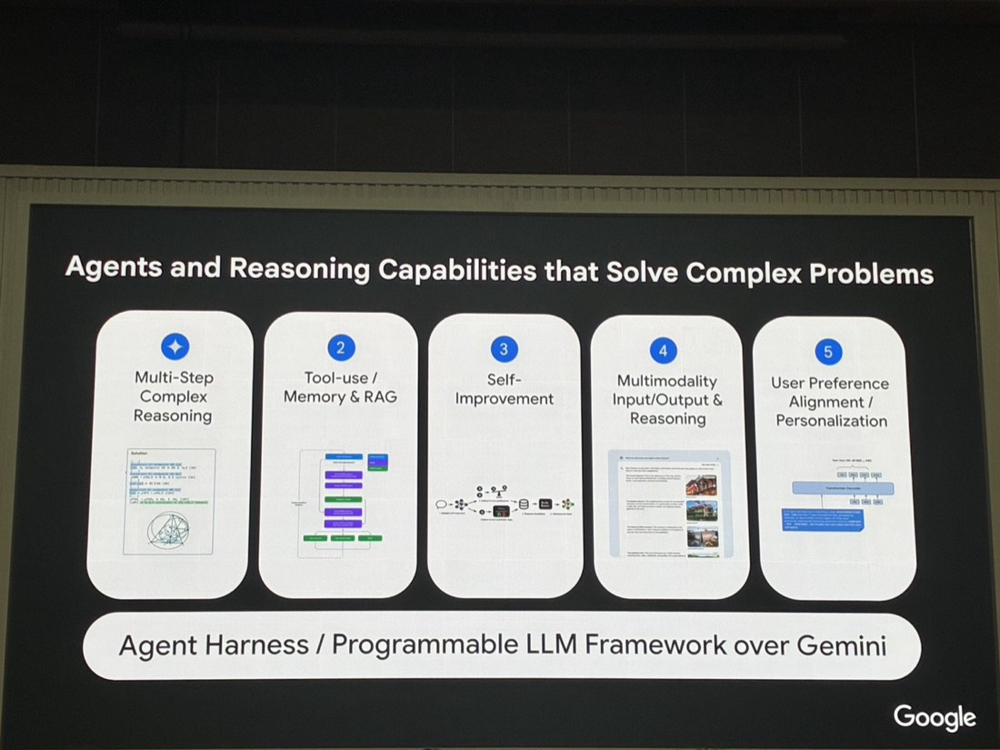
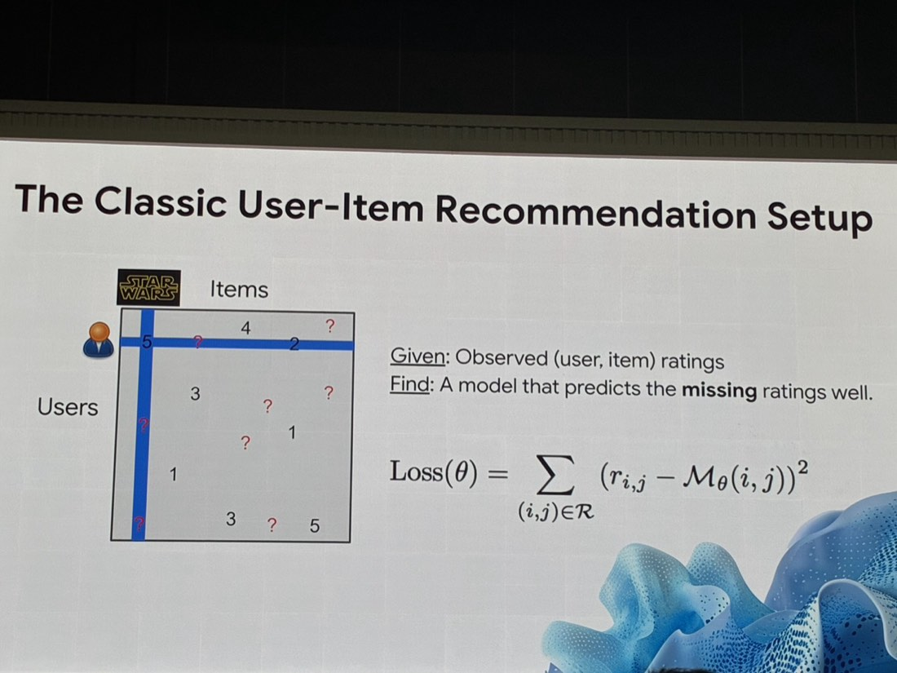
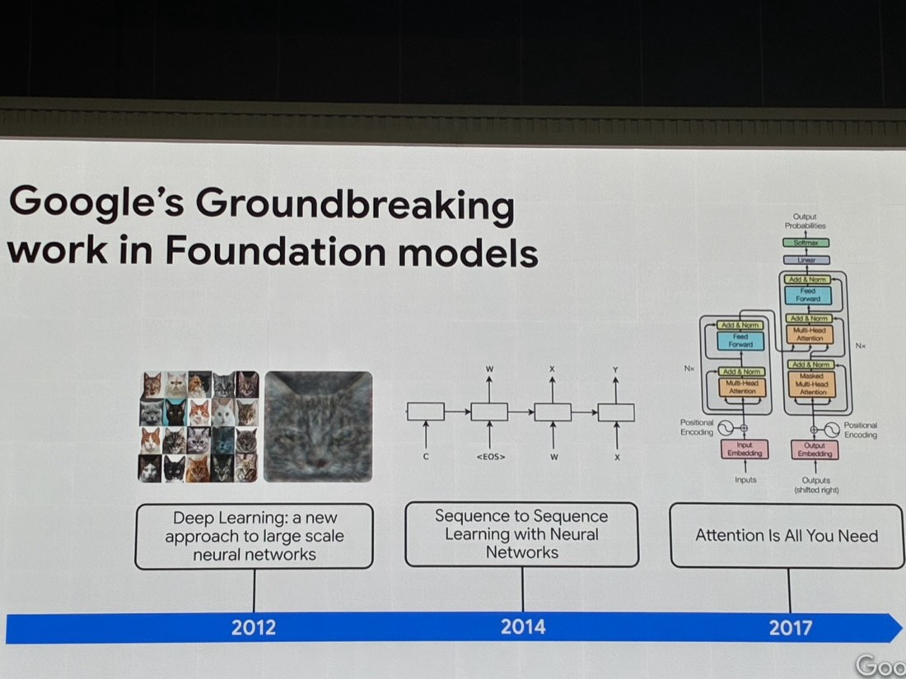
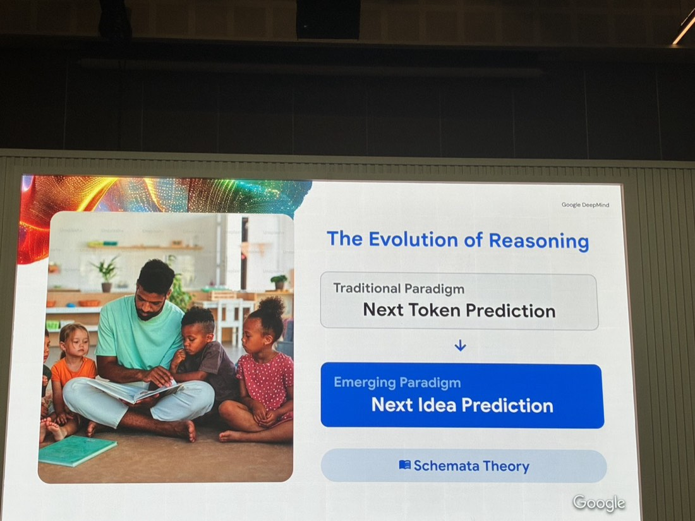

# 解構 AI 新浪潮：從語言模型邁向「多模態 AI 代理」
*Cloud Day 2026・2026-07-09*
> 回顧 Google 從 2012 深度學習到 2017 Transformer 的技術突破史，說明 AI 推理典範正從「預測下一個字」演進到「預測下一個想法」，並拆解出 Agent 解決複雜問題所需的五項核心能力。
*上午・主題演講*

**Ed Chi 紀懷新**・VP of Research, Google DeepMind

## 推薦系統的「古典」設定：作為對比基準

*經典的 User-Item 矩陣：以《星際大戰》為例，Given 已知的 (user, item) 評分，Find 一個能預測缺失評分的模型*

用經典的 User-Item 矩陣（例：使用者對《星際大戰》等電影的評分，矩陣裡有已知分數也有問號）與損失函數 `Loss(θ) = Σ(r_i,j − M_θ(i,j))²`，說明過去機器學習「猜使用者可能喜歡什麼」的基礎邏輯——這是刻意拿來當對比基準，帶出後面「LLM 時代」的典範差異：過去的模型只會「填空」，現在的模型要能「理解與推理」。

## Google 在基礎模型的三個突破里程碑

*2012 Deep Learning（貓臉辨識）→ 2014 Sequence to Sequence Learning → 2017 Attention Is All You Need（Transformer）*

| 年份 | 突破 | 意義 |
| --- | --- | --- |
| **2012** | Deep Learning: a new approach to large scale neural networks | 圖像識別新方法（如貓臉辨識） |
| **2014** | Sequence to Sequence Learning with Neural Networks | 序列到序列學習，奠定翻譯／生成任務基礎 |
| **2017** | Attention Is All You Need | Transformer 架構論文，現今所有 LLM 的技術基礎 |

## 推理典範轉移：從 Next Token 到 Next Idea

*Google DeepMind：傳統典範是 Next Token Prediction，新興典範是 Next Idea Prediction，理論基礎為 Schemata Theory*

傳統典範：**Next Token Prediction**（預測下一個字）。新興典範：**Next Idea Prediction**（預測下一個想法），理論基礎提及 **Schemata Theory**（基模理論）——意即模型不再只是逐字接龍，而是朝「理解概念、規劃想法」演進，就像人是透過故事/基模在學習與推理，而不是逐字記憶。

## Agent 解決複雜問題的五大能力

官方框架稱為 **Agent Harness / Programmable LLM Framework over Gemini**，拆解出五項核心能力：

- **1 · Multi-Step Complex Reasoning**：多步驟複雜推理
- **2 · Tool-use／Memory & RAG**：工具調用、記憶與檢索增強生成
- **3 · Self-Improvement**：自我改善
- **4 · Multimodality Input/Output & Reasoning**：多模態輸入輸出與推理
- **5 · User Preference Alignment／Personalization**：使用者偏好對齊與個人化

## 飛輪效應

> *「你的競爭對手可以買到同樣的模型，但買不到你的飛輪。」*

Better AI → Better Data → Better Decisions → Better CX → Faster Adoption → 回到 Better AI，形成正向循環——差異化優勢來自資料與應用的複利循環，不是模型本身。

## 總結

1. 「預測下一個想法」而非「預測下一個字」這個框架，是理解為什麼 AI Agent 能做規劃、任務分解的核心概念，可以用來跟同事/客戶解釋「這一代 AI 為什麼不一樣」。
2. **Agent 五大能力**這張圖可以當作評估「一個 AI 產品是不是真正的 Agent」的檢核表——是否有多步推理、工具調用、記憶、多模態、個人化，而不只是包裝過的聊天機器人。
3. 「飛輪效應」的金句很適合用在跟客戶溝通「為什麼要及早導入 AI／及早累積自己的數據資產」——差異化不是搶先用模型，而是搶先建立資料與應用的複利循環。