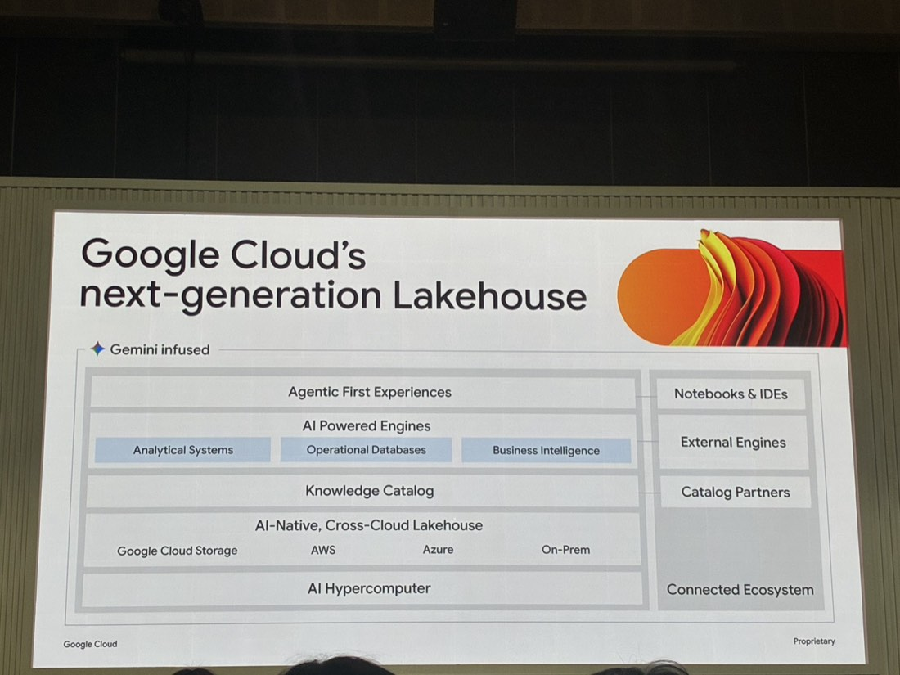
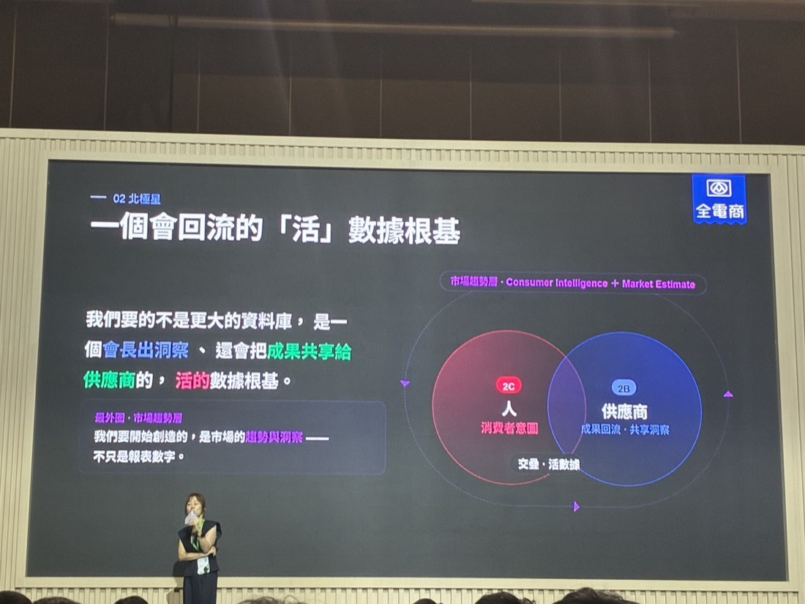

# 開放與互通的數據湖倉 —— 打造 AI 代理時代的統一數據根基
*Cloud Day 2026・2026-07-09*
> 當 AI Agent 要「讀」企業資料時，資料倉儲的角色從給人看的 Dashboard，變成要能撐住成千上萬 Agent 同時查詢、且讓 AI「聽得懂」資料背後語意的基礎建設；Google Cloud 用開源的 Iceberg 格式打造跨雲的開放 Lakehouse，全聯／全支付則分享把「全支付 App」做成集團 Data Hub 的數據變現實戰。
*下午・資料平台與開發平台*

**Cory Hu**・Google Cloud 台灣解決方案架構師
**Paris Lo 羅煒茜**・全聯實業全電商營運部特助

#### 第一段 · Cory Hu（Google Cloud）

## 為什麼 AI 時代需要新的資料架構

- **從人到 Agent 的量級跳躍**：過去 Dashboard 頂多同時服務百人～千人；Agent 時代可能有**上千甚至上萬個 Agent 同時查詢**，資料庫要能扛住這種高頻請求量，不只是介面好不好看的問題。
- **從被動到主動**：以前是人發現問題才查資料；現在 Agent 要能**主動發現**（如庫存不足自動分析並下單補貨、廣告投放效率不好自動重新規劃）。
- **要讓 AI「懂」資料，不只是「讀」資料**：資料庫欄位（如 uid）對人來說有背景知識，但 Agent 看不懂潛規則，要把這些內隱的 business logic 轉成 Agent 能理解的 **Semantic Knowledge**。

## 企業常見的四個資料痛點

1. 傳統 Lakehouse 處理不好**非結構化資料**（圖片、影音），但很多關鍵知識就藏在這些資料裡。
2. **多雲環境**下，資料分散在 Google Cloud / AWS / Azure，Agent 跨雲取資料會遇到 **latency** 與**高額 egress 費用**兩個問題。
3. **信任問題**：Agent 讀資料時容易產生幻覺，回答不準確。
4. **Data Silo／即時性落差**：分析用資料庫可能半天到一天才跟即時交易資料同步一次，導致客服 Agent 無法即時處理剛發生的問題。

## Google Cloud Lakehouse（基於 Apache Iceberg 開源標準）

官方架構圖由下而上：**AI Hypercomputer**（底層算力，串接 Connected Ecosystem）→ **AI-Native, Cross-Cloud Lakehouse**（Google Cloud Storage／AWS／Azure／On-Prem，串接 Catalog Partners）→ **Knowledge Catalog** → **AI Powered Engines**（Analytical Systems／Operational Databases／Business Intelligence，串接 External Engines）→ 最頂層 **Agentic First Experiences**（串接 Notebooks & IDEs），整條堆疊都標註「Gemini infused」。

- 用開源 **Iceberg** 格式（近一年 Google Cloud 上 Iceberg 資料量成長 **3 倍**，達 10～100PB 等級），優點是開放性＋讀寫一致性，特別適合 Agent 大量查詢。
- **關鍵功能**：
  - **Small File Compaction**：自動把頻繁寫入產生的小檔案合併，避免查詢效能因檔案數暴增而下降。
  - **Knowledge Catalog**：自動整理結構化＋非結構化資料，把 Domain Knowledge 攤開給 Agent 理解（如「這欄位是財報資料」）。
  - **Governance（治理）**：一次設定 Table Label 權限，不論用什麼工具（BigQuery、Spark、第三方 Trino/Flink）查詢，權限限制都一致生效。
  - **自然語言資料搜尋**：直接說「我要找財報相關資料」，系統列出所有候選資料集。
  - **Data Product（資料產品化）**：把資料+商業知識包裝成一個可被直接查詢的「產品」，避免每次分析都要重新拼湊資料來源。
  - **跨雲快取（Managed Cross-cloud Cache）**：第一次從別雲拉資料付一次 egress 費，之後快取在 Google Cloud 本地，同筆資料不會重複收費，且查詢更快。
- **First-Party Agent + 可拆解的 Skill**：Google 提供現成的 Data Agent（給不同部門角色：資料工程、資料科學、業務、開發者），也能把裡面的「查詢 BigQuery」等 Skill 單獨抽出來，組進自己客製的 Agent。

---

#### 第二段 · Paris Lo 羅煒茜（全聯／全支付）

## 把全支付 App 做成集團 Data Hub

全聯把「全支付 App」定位為集團的 Data Hub，用內部 CRM/交易數據＋Google 的第三方數據（搜尋趨勢等）交叉比對，做到對供應商的「預測式建議」、對消費者的「千人千面推薦」。

*全電商的北極星構想：2C（人／消費者意圖）與 2B（供應商／成果回流‧共享洞察）交疊出「活數據」，外圍再疊上市場趨勢層（Consumer Intelligence + Market Estimate）*

官方投影片用一張文氏圖說明「北極星」構想：**2C（人）＝消費者意圖**，**2B（供應商）＝成果回流‧共享洞察**，兩者交疊處才是「活數據」；最外圍再包一層「市場趨勢層」（Consumer Intelligence + Market Estimate）。原文金句：「我們要的不是更大的資料庫，是一個會長出洞察、還會把成果共享給供應商的，活的數據根基。」

- **全聯的數據體量優勢**：1,200 多家門市（每店至少 300 坪）、線上會員近 **1,200 萬**人，數據量體足以支撐有意義的分析（強調「沒有 Quantity 就沒有 Quality」）。
- **B 端（供應商）痛點翻轉**：過去是供應商「自己覺得」該上架什麼商品；現在全聯想做的是**用數據做 Prediction，主動告訴供應商該生產/上架什麼**，而不是被動等供應商決定。
- **C 端（消費者）**：目標是「千人千面」，在使用者只給 3 秒關注力的情況下做到個人化推薦；強調線上線下要當同一個人看待（cross-channel），而非分開的兩套會員系統。
- **落地方法**：Internal Data（自家 CRM、交易、電子發票）＋ External Data（Google Trend、Google Cloud Service）交叉比對，做出更細緻的顆粒化受眾（例：從「買防曬」這種淺層關鍵字，深化到「新婚→居家風格改變」這種人生階段推論）。
- **提醒**：資料應用**去識別化**、符合 ISO 27001；反覆強調「Data 是一個循環（Cycle），不是貼完標籤、發完 Coupon 就結束」，每次 Campaign 要跟下一次串連比較（MoM／YoY），不能做完就變成「驗屍報告」。

## 總結

1. **資料治理是 AI Agent 化的地基**——這場跟「Google AI 釋放產業動能」場的 Garten Food Service 案例呼應：先把資料集中化、結構化，AI 才有東西可用。
2. **開放格式（Iceberg）值得留意**：不被單一雲綁死，未來若客戶有多雲需求，這是選型的重要考量。
3. 「把資料包裝成可查詢的產品」這個概念，也可以用在我們自己整理的客戶數據／SEO 成效資料上。
4. 大型零售集團把「數據治理＋跨部門整合」講得很直白：**先把 Internal Data 清乾淨，再談 External Data 匯流**，順序不能顛倒。
5. 「不要用推播 Coupon 殺雞取卵式地創造回購」這句提醒，對我們幫客戶做行銷操作規劃時是個值得提的觀點。