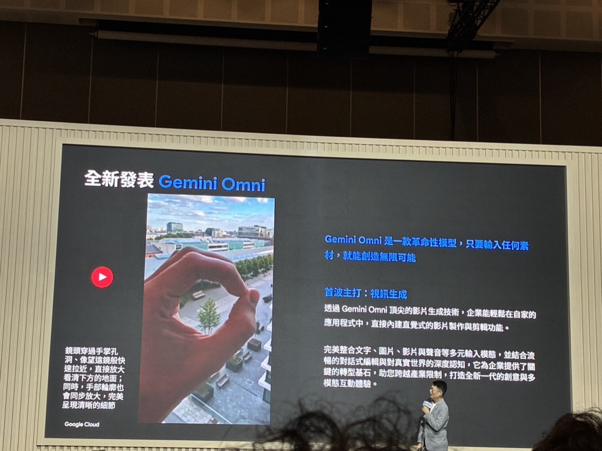
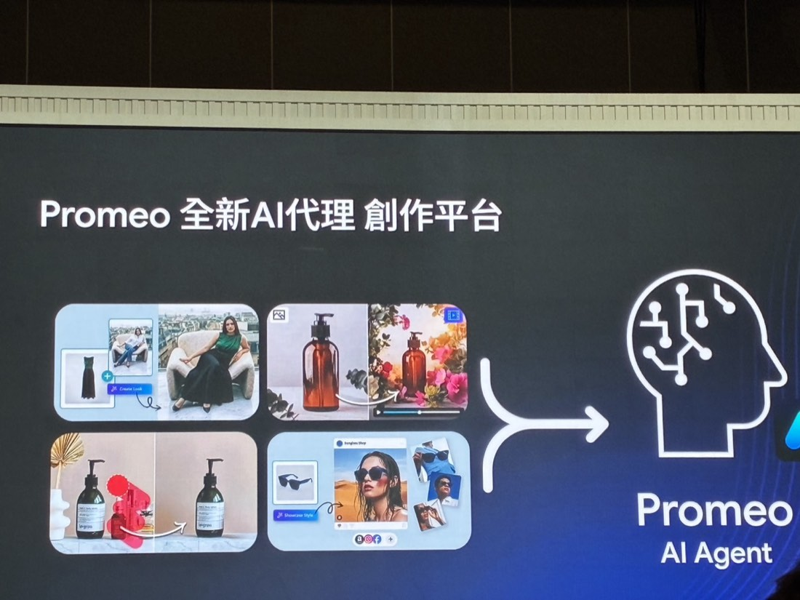

# 加速產品創新：以生成式媒體 AI 驅動市場競爭優勢
*Cloud Day 2026・2026-07-09*
> Google 最新生成式媒體模型 Gemini Omni 系列已經能理解「物理世界的邏輯」（水流方向、物體掉落），支援一次輸出影片＋配聲＋對話式局部修改；訊連科技把這些技術（含 Nano Banana Pro、Veo 3.1、Gemini VLM）落地成 Promeo，讓中小型商家能用文字快速產出行銷素材。
*下午・加值產業轉型與智慧代理*

**Ben Lee**・Google Cloud 台灣 AI 解決方案資深協理
**Phoebe Lee 李其嘉**・Business Product Lead, Cyberlink

#### 第一段 · Ben Lee（Google Cloud）

## 全新發表：Gemini Omni

> **官方定位文案**
>
> 「Gemini Omni 是一款革命性模型，只要輸入任何素材，就能創造無限可能。首波主打：視訊生成——透過 Gemini Omni 頂尖的影片生成技術，企業能輕鬆在自家的應用程式中，直接內建直覺式的影片製作與剪輯功能。完美整合文字、圖片、影片與聲音等多元輸入模態，並結合流暢的對話式編輯與對真實世界的深度認知，它為企業提供了關鍵的轉型基石，助您跨越產業限制，打造全新一代的創意與多模態互動體驗。」

現場示範案例：「鏡頭穿過手掌孔洞、像望遠鏡般快速拉近，直接放大看清下方的地面；同時，手部輪廓也會同步放大，完美呈現清晰的細節」——這個 demo 直接展示 Omni 對物理世界光學邏輯（望遠鏡效果）的理解，不是單純的畫面生成。

## Gemini Omni 系列的三大特點

- **理解真實物理世界**：不是單純把文字變成生動影片，而是模型真的理解物理規律——水流方向、物品掉落、透過鏡頭看出去的光學效果都合乎邏輯。
- **原生多模態輸出**：一次輸出影片＋對應的環境音效（示範案例：小丑魚動畫連水聲都同步生成），不是影片、聲音分開處理。
- **對話式局部修圖／修片**：過去生成模型的痛點是「改了這裡、跑掉了那裡」（人物臉部改變、衣服變了）。Omni 可以**只針對你要改的物件下 prompt**，其餘畫面 100% 原樣保留，大幅節省重跑成本。
- **其他能力**：品牌一致性複製（同系列產品套用同一視覺風格）、風格轉換（不動主體人物、只換背景場景）、草圖轉動畫（畫一條箭頭+一隻魚就能生成指定動線的動畫，加速創意發想到動畫師執行的溝通）。
- **周邊產品**：**Veo** 可把低解析度影片提升到 4K；**Lyria 3** 能依文字甚至依「圖片順序」自動編曲、寫詞、演唱，聲音表情細膩（不是過去梗圖等級的機械音）。

---

#### 第二段 · Phoebe Lee 李其嘉（訊連科技）

## Promeo：全新 AI 代理創作平台

*訊連科技 Promeo：從穿搭造型生成（Create Look）、產品場景轉換（含短影音）、居家風格換場，到社群風格圖卡（Showcase Style，同步發布至 Amazon／Instagram／Facebook），最終收斂成一個 Promeo AI Agent*

投影片展示了四種實際素材類型的處理範例：**穿搭造型生成**（Create Look，模特兒換裝效果圖）、**產品瓶罐場景轉換**（靜態商品照轉場景化短影音）、**居家風格情境轉換**（同商品換不同居家風格背景）、以及**社群風格圖卡**（Showcase Style，直接排版成 Instagram／Facebook／Amazon 風格的商品貼文）——四種輸出最終都收斂進同一個 **Promeo AI Agent** 裡統一調度。

- **產品定位**：串接 Nano Banana Pro（生圖）、Veo 3.1／即將推出的 Omni（生影片）、Gemini VLM（辨識圖片中的文字/產品位置），把 Promeo 從「單純工具」升級為「**AI 創意引擎**」。
- **使用流程**：使用者上傳素材＋一句話描述，AI Agent 透過多輪對話確認需求（如：賣鞋商家可用文字生成不同背景、不同顏色鞋款的影片），最後在產品內完成**後製微調**（換文字、換顏色，如把「Christmas」檔期文案快速改成「New Year」，重複利用同一素材）。
- **時程**：8 月初正式上線。
- **核心價值主張**：降低 AI 應用門檻——中小企業／個人品牌（如藝人經紀）也能靠文字對話打造「AI 行銷顧問」等級的素材產出能力。

## 總結

1. **生成式媒體 AI 的門檻正在快速下降**，「文字對話→行銷素材」已經是可交付的產品體驗，不是實驗室階段。
2. **局部修改（不動其餘畫面）＋多輪對話確認需求**這兩個體驗設計，是我們評估/選用生圖生影片工具時該優先看的能力，直接關係到客戶端能不能真正上手用。
3. 訊連的落地路徑（串接多個 Google 模型 + 包成產品體驗）是個好參考範本：技術不用自己從頭做，重點在整合與體驗設計。Promeo 一次涵蓋「造型生成／場景轉換／社群圖卡」三種輸出，值得參考它如何用同一套底層技術服務多種行銷素材需求。